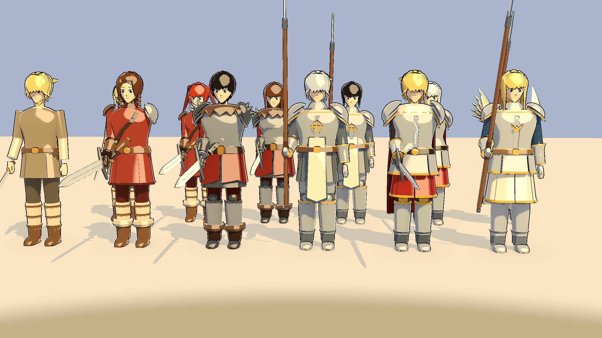
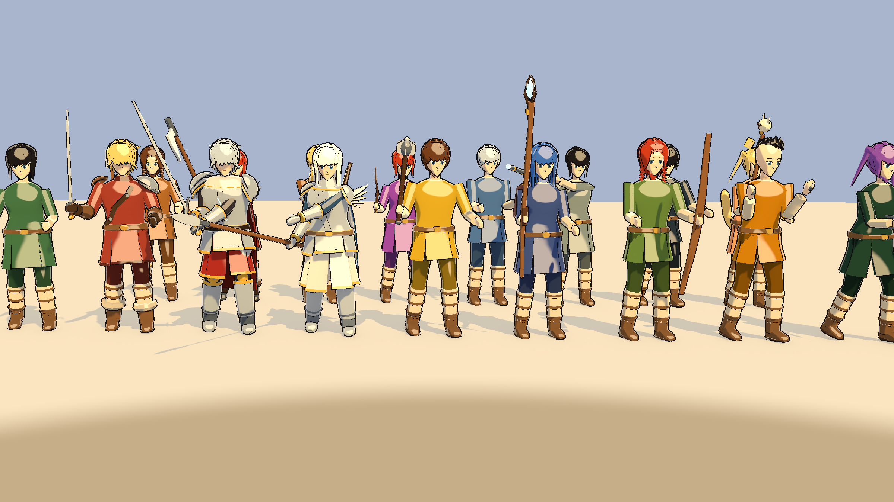
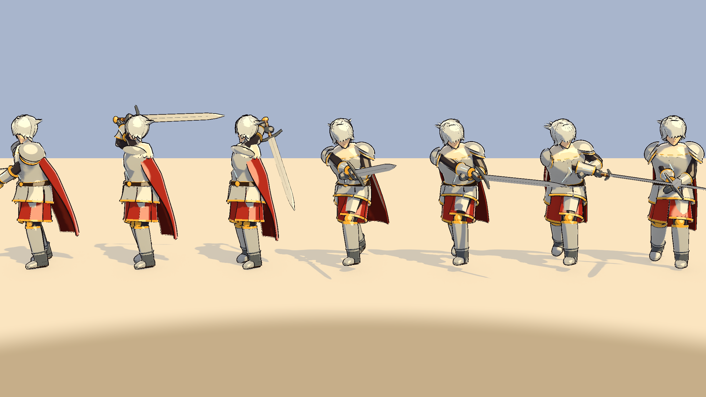
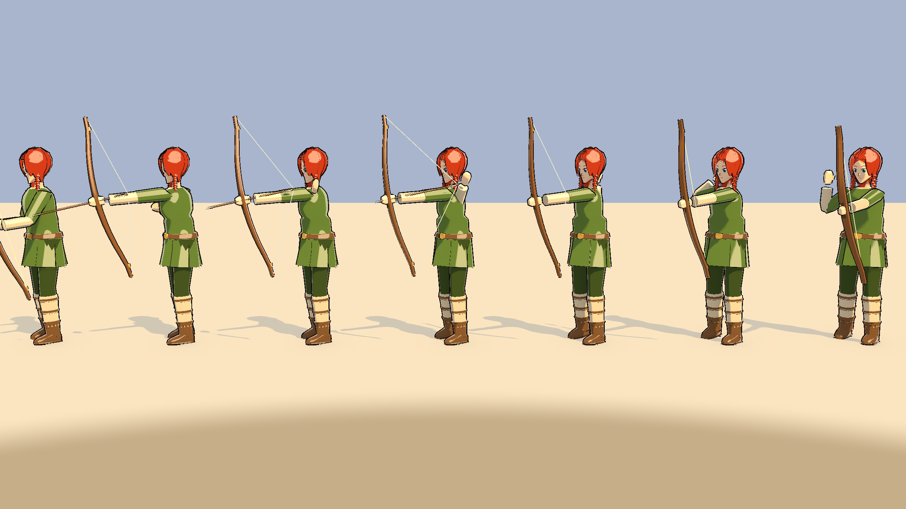
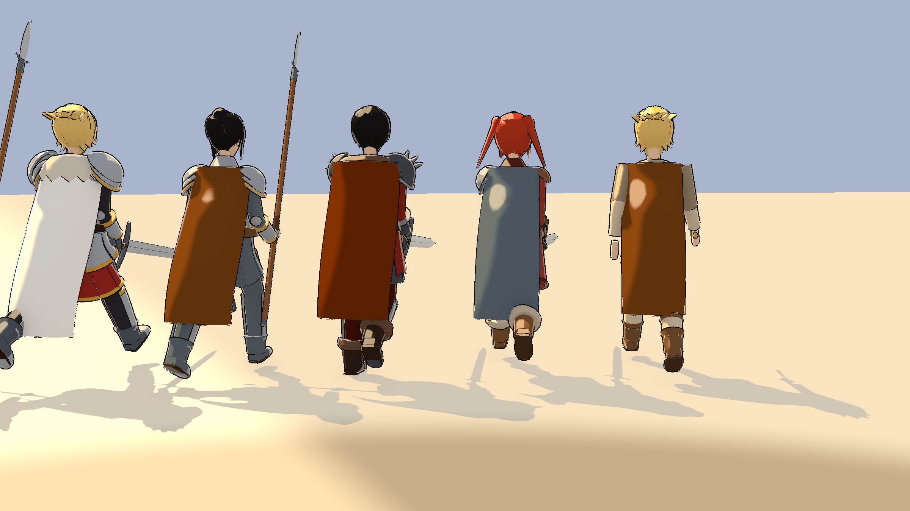

# Art Pass 1: Characters, the Warrior Line, Weapons and Actions

The concept art ("Option B") sets the target: an anime hero about six heads tall in Norse kit, cel-shaded with ink lines, in a snowy isometric world. This art pass:

- replaces the capsule doll with a rigged body built in Blender
- dresses the Warrior line (Ragnarok's Swordman tree) in their own outfits
- models every weapon type
- gives each weapon class its own fighting actions, modelled on Ragnarok's (as played on XileRO)



*From left: the common clothes (Initiate), Warrior, Berserker, Guardian, Einherjar and Valkyrie. Men in front, women behind. Rendered in Unity by Runeheir ▸ Art ▸ Render Character Lineup, under Vigrid Haven's sun.*



*Every weapon type, held in the battle stance: seax, Viking sword, greatsword, spear, mace, staff, longbow, knuckles, katars, bearded axe, Dane axe, lyre, whip, rune tome, thunder-rod, huuma and the cat staff.*



*One basic attack frame by frame: ready, wind-up over the shoulder, strike (the hit lands on the fifth frame), follow-through and recovery. Both hands stay on the grip.*



*The archer's shot: bow in the left hand, the string drawn to the cheek with an arrow nocked, then loosed on the hit frame. The game's projectile flies from there.*

---

## 1. What changed in the game

- **Every human wears the rigged body:** you, other players online, NPCs and humanoid monsters. A man is 1.75 m, a woman 1.72 m, both with the same anime head (big eyes, brows in the hair color).
- **Warrior-line outfits**, male and female:

| Job | Ragnarok | Outfit |
|---|---|---|
| Warrior | Swordman | Red quilted gambeson, leather baldric, one steel pauldron on the shield side, leather bracers, leg wraps, fur-cuffed boots |
| Berserker | Knight | Bear pelt over the shoulders, steel lamellar, spiked pauldrons with ember runes, mail skirt under a torn war-skirt, spiked gauntlets |
| Guardian | Crusader | Smooth plate with a gold sun-cross, a white tabard, layered round pauldrons, mail sleeves and skirt, plated legs |
| Einherjar | Lord Knight | Valhalla plate trimmed in gold, a white fur collar, a long crimson cape, glowing blue runes (the concept's hero) |
| Valkyrie | Paladin | Silver plate, feather-winged pauldrons, a white skirt under tassets, a sky-blue cape |

- **Every other job** wears the common traveller's clothes, tinted with its job color, until its own outfit is made. High Warrior wears the Warrior's outfit.
- **Hair:** the eight styles on the creation screen (Short, Spiky, Long, Ponytail, Twin Tails, Bun, Mohawk, Viking Braids), modelled as layered anime locks.
- **Weapons:** a model for each of the 17 weapon types, held in the fist. Archers hold the bow in the left hand, tomes and lyres are held in the left hand too, and knuckles and katars go on both hands.
- **Cloaks:** a worn cloak (Traveler's Cloak, Wolfskin Mantle, Bear Pelt, Valkyrian Manteau...) is a cape fitted to each outfit and skinned to the body, in the item's color. It clears pauldrons, collars and belts, and replaces the outfit's own cape. Wings and mufflers still hang from the back socket.



- **Helmets, eyewear, masks and shields** sit on the head and the left forearm. They are still the primitive shapes.
- **Freyja's Kin** keep their ears and tail on the new body, and are now really 15% smaller (the old doll's scale was reset every frame).

If the character models are missing from the project, the game falls back to the old capsule doll.

## 2. Actions (after Ragnarok's)

Ragnarok gives every character a stand, a walk, a battle "standby" stance and, per class, its own attack, a casting pose, a flinch and a death. Runeheir does the same, procedurally on the skeleton (`RigPoses`), timed by the same combat code as before. Swings are ASPD-scaled and every attack lands on its middle frame.

| Weapon class | Battle stance | Basic attack (alternates through the combo) |
|---|---|---|
| Swords, axes, maces, daggers, whips, huuma | Blade up in front, a light crouch | Forehand diagonal, backhand sweep, overhead chop |
| Greatswords and Dane axes | Held across the body in both hands | Great diagonal over the shoulder, rising cut |
| Spears | Held low and level, the off hand on the shaft | Thrust with a step, flat sweep |
| Staves and cat staves | Staff planted, free hand ready | Overhead strike, side swing |
| Bows | Bow raised in the left hand | Draw to the cheek, loose on the hit, follow-through |
| Thunder-rods | Shouldered, both hands | Aim and recoil |
| Fists and knuckles | Boxer's guard | Cross, jab, hook |
| Glíma line, bare-handed | Guard on the toes | Roundhouse, front kick, heel drop (Ragnarok's Taekwon kicks) |
| Katars | Low crouch, both blades forward | Twin stab, alternating stabs |
| Tomes | Book held up in the left hand | Palm strike |
| Lyres | Lyre at the chest | Struck chord |

- **The battle stance** is taken whenever the character swings, casts or is hit, and is held for 5 seconds. Otherwise the stance is relaxed.
- **Casting** raises the staff toward the target (tomes and other weapons have their own poses) and draws Ragnarok's rune circle at the caster's feet: two counter-turning rings around a seven-pointed star. Monsters that cast get it too.
- **Skill motions use the weapon:**
  - Thrust: the spear lunge for spears, a stab for blades.
  - Shoot: the bow draw for bows, the shot for thunder-rods, a throw for the rest.
  - Punch: kicks for the Glíma line.
  - Leap: an overhead blow.
  - Spin and Buff: their own poses.
- **Slash trails:** melee weapons leave a glowing arc during the strike, in the outfit's rune color (the Einherjar's is blue, like the concept).
- **Two-handed weapons** keep the second hand on the grip, by two-bone IK. So do spears and thunder-rods in the battle stance. The same IK draws the bowstring hand back to the nock.
- **Running, flinch, stagger and death** work as before. Arms swing less while carrying a two-handed weapon.

## 3. The pipeline

Everything is built by code, so the art rebuilds identically and can be reviewed like any other change.

```
Tools/Blender/build_characters.py   entry point: builds, exports, renders previews
Tools/Blender/rh_geo.py             mesh helpers (lofts, tubes, panels, domes, straps)
Tools/Blender/rh_body.py            skeleton, body proportions, the head and face
Tools/Blender/rh_hair.py            the eight hair styles
Tools/Blender/rh_outfits.py         outfit pieces, the job outfits, their palettes and fitted cloaks
Tools/Blender/rh_weapons.py         the 17 weapon models and their palette
```

Rebuild with Blender 5.2 (about 10 seconds):

```
"C:/Program Files/Blender Foundation/Blender 5.2/blender.exe" -b --factory-startup -P Tools/Blender/build_characters.py
```

Options after `--`: `--only warrior,einherjar` builds some outfits, `--no-render` skips the preview renders. It writes:

| Output | What |
|---|---|
| `Assets/_Runeheir/Resources/Characters/<outfit>_m.fbx`, `_f.fbx` | The rigged body in that outfit; its own `Cape`, and the hidden `GarmentCape` for worn cloaks |
| `Assets/_Runeheir/Resources/Characters/hair_<0-7>.fbx` | Hair, modelled around the Head joint |
| `Assets/_Runeheir/Resources/Characters/Weapons/<WeaponType>.fbx` | One model per weapon type, gripped at the origin; the bow has a separate `String` and `Arrow` |
| `Assets/_Runeheir/Resources/Characters/outfits.json` | Each outfit's palette, the jobs that wear it, the weapon palette |
| `Tools/Blender/Previews/lineup_*.png` | Quick Blender renders (not the game shader) |
| `Tools/Blender/Out/characters.blend` | The built scene, to open and inspect |

Then see them in the game's shader: **Runeheir ▸ Art ▸ Render Character Lineup**, or from the command line with a GPU:

```
-executeMethod Runeheir.EditorTools.CharacterLineup.RenderFromCommandLine
```

It writes these to `Tools/Blender/Previews/`:

- `unity_lineup_*`: the outfits
- `unity_cloaks_back`: the worn cloaks, from behind
- `unity_weapons`: every weapon in hand
- `unity_strip_*`: attack filmstrips for the sword, backhand, greatsword, spear, staff and bow
- `unity_cast`: the casting poses

### Conventions

- **Axes.** Characters are built in Blender with Z up, the character facing -Y and its left at +X. The export turns them 180° so Unity sees the front at +Z and the left at -X.
- **Weapon axes.** Weapons are built with the grip at the origin, the tip along +Z and the edge (the side that leads a cut, an axe's bit, the bow's back) along +X. They export unturned.
- **Import settings.** `CharacterModelPostprocessor` sets the import: scale 1, axis conversion baked, skinning kept, no Animator. The repository keeps no `.meta` files, so these settings come from that script.
- **Bones** use Unity Humanoid names: `Hips, Spine, Chest, Neck, Head`, `Left/Right` + `Shoulder, UpperArm, LowerArm, Hand, UpperLeg, LowerLeg, Foot, Toes`.
- **Material slots.** The FBX materials only carry names; the game paints each slot through `Runeheir/Toon`:

| Slots | Colored by |
|---|---|
| `Skin`, `Hair`, `Brow` | the character (skin, hair color; brows a shade darker) |
| `Eye`, `EyeWhite`, `Lash`, `Highlight`, `Mouth` | fixed; drawn without ink outlines |
| `Cloth`, `ClothDark`, `Under`, `Leather`, `LeatherDark`, `Metal`, `MetalDark`, `Gold`, `Fur` | the outfit's palette (`$outfit` = the job color) |
| `Glow` | the outfit's palette, self-lit (runes); also the slash-trail color |
| `Garment`, `GarmentDark` | the worn cloak item's color |
| Weapons: `Steel`, `SteelDark`, `Wood`, `WoodDark`, `Leather`, `Gold`, `Gem` (self-lit), `String`, `Paper`, `Cover` | the weapon palette |

### Adding the next outfit (Mystic line, and so on)

1. In `rh_outfits.py`, write `outfit_<key>(B, C, P)` from the pieces. Start with `base_head(B, P)` and `hands(...)`, then pick from:
   - clothes: `shirt`, `sleeves`, `trousers`, `boots`, `belt`, `skirt` (panels that follow the legs), `tabard`
   - armour: `cuirass`, `pauldron` (lames, trims, spikes, feathers, runes), `bracers`, `greaves`, `cuisses`, `gorget`
   - extras: `fur_collar`, `cape` (into `C`), `harness`, `emblem`, `rune_line`
2. Add its palette to `PALETTES`, its jobs to `OUTFIT_JOBS`, the function to `OUTFITS` and a cloak fit to `GARMENT_FIT`.
3. Run the build, then Render Character Lineup.
4. `CharacterArtTests` checks every outfit in `outfits.json`: both genders load, the full skeleton, skinning, the fitted cloak and only known material slots.

### Tuning an action

The poses are data in `RigPoses.cs`. Each one is a list of rotations per bone, in the model's own axes:

- X+ swings a hanging limb back; X- raises it forward.
- Y+ turns the right shoulder back.
- Z+ moves a hanging hand toward the character's right.
- A weapon points along the fist's channel, so a positive `RightHand` angle rolls it down and forward. Strikes use that to meet the target.

Change a key, run Render Character Lineup and look at the filmstrips.

## 4. In Unity

- `OutfitCatalog` reads `outfits.json`: which outfit a job wears, slot colors, the model, hair and weapon paths, and the weapon palette.
- `RiggedBody` builds the character:
  - puts on the model, paints it and adds the hair
  - puts the weapon in hand (a bow with a drawable string and a nocked arrow)
  - gives gear its sockets; each socket keeps the old doll's coordinates, so every helmet, shield and wing builder works unchanged
  - each frame, poses the bones from `RigPoses`, then runs the IK, the bowstring and the trails
- `PlaceholderAvatar` builds the rigged body for humanoids; monsters stay primitives. It drives the body with the combat timing (ASPD swing length, skill durations, cast, hit, stagger, death), and it tracks the combo and the battle stance.
- `WeaponTrail` draws the slash arcs; `CastCircle` draws the rune circle.
- **Keyframed animation later:** set the import to Humanoid, build a controller with Runeheir ▸ Animation ▸ Create Character Animator Controller, and `CharacterAnimationBridge` plays clips instead.

## 5. Known limits

- **A step toward the concept, not the final look.** Outfits and weapons are flat colors with no painted textures yet. The concept's painted environment, lighting and effects are their own passes.
- **Weapons are one model per type.** Every sword looks like the Viking sword, every bow like the longbow, and so on. Per-item looks (a Flamberge, a glowing Einherjar Greatsword) come with the item database work.
- **Helmets, shields, wings and monsters** are still primitive shapes.
- **Hands** are mitten fists.
- **Capes and skirts** are skinned to the body with no cloth simulation, so legs can clip tassets at a full run.
- **Actions are procedural keyframes, not hand-animated clips.** They read clearly at the game camera but are stiffer close up.
- **34 jobs** still wear the common clothes.
- The lineup renders use Vigrid Haven's warm sun with no tonemapping (the game has none either), so whites and steel run bright.

## 6. Tests

- `Tests/Editor/CharacterArtTests` (EditMode):
  - the catalog maps each job to its outfit
  - every outfit is skinned, with the full skeleton, a fitted cloak and only known slots
  - every weapon type has a model in the weapon palette
  - the models face +Z at human height
  - the avatar wears its hair, weapon, helm, shield and cape
  - worn cloaks use the fitted cape, and wings don't
  - a one-handed swing rises then cuts down and across, then everything returns to rest
  - the bow is held in the left hand, drawn before the hit and loosed on it
  - two-handed weapons keep both hands on the grip
  - Freyja's Kin keep their ears and tail
  - the Glíma line kicks
- `PrototypeSmokeTests` (PlayMode): the player wears the rigged body, and a job change puts on the Einherjar's outfit with the weapon in hand.
